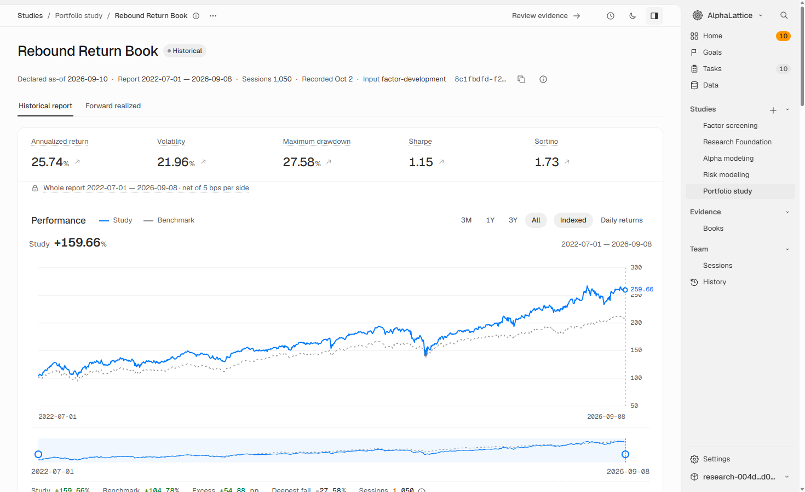
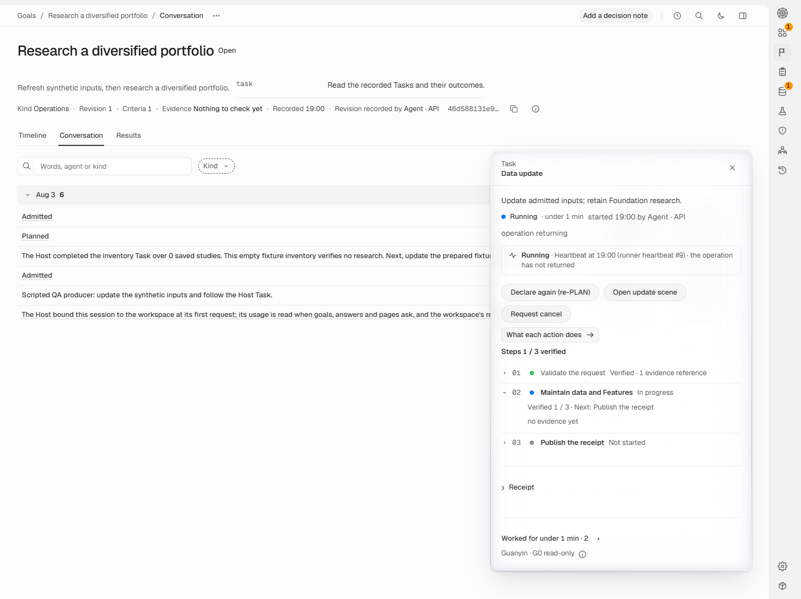

# AlphaLattice
Date: 2026-10-08

AlphaLattice is a local quantitative research workstation for people using Codex or Claude Code to investigate investment ideas.

<picture>
  <source media="(prefers-color-scheme: dark)" srcset="docs/images/workbench-dark.webp">
  
</picture>

*A historical research replay on recorded US market data, from 2022-07-01 to 2026-09-08. The report's figures are shown as recorded; this book is not reviewed. Historical research is not investment advice or a promise of future returns.*

## What one sentence gets you

Ask your agent to research factors, compare models, assess risk and build a
reviewed book. It leads Data, Factor, Alpha, Risk, Portfolio, Evidence Analyst
and CRO specialists. Follow Tasks, results, source passages and review in the Workbench.

After an installed strategy's reviewed book is activated, the agent can show dated forward
research positions. Historical holdings are replay results; forward positions
are research, not orders or advice.

## Start with one sentence

Give your Codex or Claude Code agent this repository's link and one intent:

> Use https://github.com/xinglin-li/alphalattice to build me a reviewed installed strategy from public data and show its dated research positions; open the Workbench in your browser so I can follow it.

The agent installs AlphaLattice and continues in the same session. Its specialists'
tool limits hold by instruction. For limits enforced by the host, open a checkout
session with `cd <checkout>; claude` in Claude Code or `codex -C <checkout>` in
Codex. The [agent guide](AGENTS.md) gives the procedure.

Your exact sentence opens the first-use goal. Its 24-hour delegation lets the
agent handle admitted preparation and activate its reviewed book, reporting
each act. Deactivate on **Portfolio**; stopping the goal and cancelling a Task
are separate. [Getting started](docs/public-source/getting-started.md) explains
first use; the guide names [what only you decide](AGENTS.md#what-only-a-person-decides).

## Setup and research

The [setup procedure](.agents/skills/alphalattice-research/references/operating.md)
covers locked dependencies on Windows with Python 3.12 and uv, an editable
checkout or installed wheel, and Local Web. **Windows is verified; macOS and
Linux are unverified.** Downloads need applicable consent. Measured time and
memory carry no runtime guarantee.

[Research flows](docs/public-source/research-flows.md) explains studies, installed
strategies and review. **Rebound Return Book** and **Trend Rebound Book** are
installed strategies, distinct from research study books. Read each position's
basis, information cutoff, first actionable session and horizon. Calculation
alone grants no activation or publication.

## Read results and decide

*A demonstration Goal Conversation with real Host Tasks and scripted fixture messages: an empty study check finished, and a data update is running. This shows the interface, not native agent authorship or research validation.*

Use **Goals** for Timeline, Conversation and Results, **History** for saved
studies and reviews, and **Team** for recorded sessions and usage. Acceptance
alone establishes no scientific validity or specialist authorship.

Local Web includes Chinese; CLI detail uses `--lang zh`, for example
`alphalattice workspace show --lang zh`, with English fallback.

Read result standing, coverage and time limits, including survivorship, Sector
backfill and historical source availability. A needed decision names its issue
and page.

## Guides and care

| Guide | What it explains |
| --- | --- |
| [Getting started](docs/public-source/getting-started.md) | Prepare for installation and first use. |
| [CLI](docs/public-source/cli.md) | Read answers and continue saved requests. |
| [Research flows](docs/public-source/research-flows.md) | Follow studies, books and review. |
| [Agents](docs/public-source/agents.md) | Follow goals, sessions and specialist work. |
| [Extending](docs/public-source/extending.md) | Develop and inspect factors and models. |
| [Data and care](docs/public-source/data-and-care.md) | Update, inspect, back up and restore a workspace. |
| [Privacy](docs/public-source/privacy.md) | Read what usage records contain and disable their reader. |
| [Downloads and data terms](docs/public-source/third-party-and-data.md) | Read the terms for models and data sources. |

The [guide index](docs/public-source/README.md) links the other reference pages.

This checkout is yours and your agent's to change: fix bugs and add strategies,
models and features through the [source-change path](docs/public-source/extending.md#source-owners-and-expected-changes).

Use [backup and restore](docs/public-source/data-and-care.md) into a new directory
and keep sealed records intact. [Privacy](docs/public-source/privacy.md) explains
recorded usage and its switch.

## About and licence

Created and maintained by Xinglin Li: [LinkedIn](https://www.linkedin.com/in/xinglin-li-381571139/)
or [xinglin789@outlook.com](mailto:xinglin789@outlook.com).
[Apache-2.0](LICENSE) covers the software; [NOTICE](NOTICE) records third-party
material. Downloaded models and acquired data keep their own terms. See
[governance](GOVERNANCE.md) for project decisions and contribution credit, and
[contributing](CONTRIBUTING.md) for the opening condition, agreement and workflow.

## Verify a source checkout

After `uv sync --locked --all-extras`, build Local Web with
`uv run python scripts/build_local_web_ui.py --product` before running the
[public checks](CONTRIBUTING.md). Tests check that build at session start,
rebuilding once if it is missing or stale; a failed build fails the run.

## Development history

AlphaLattice has been developed privately since 2026-08-06, with about 6,000
commits in private development by 2026-10-08. Each public commit contains one
shipped change exported from that development; releases publish the resulting
versions.

The public repository starts at 0.1.x; earlier development happened privately.
