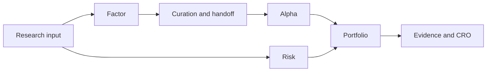

# Research dependencies and results
Date: 2026-10-03

Start with a published input. Factor research leads through curation and handoff to Alpha. Risk runs on the same input in parallel. Portfolio consumes Alpha scores and, when its declared sizing method reads risk, a compatible Risk study. Evidence and the CRO review the resulting book.

## Select input and prerequisites

Data preparation and updates publish immutable inputs; an earlier study stays bound to its input. Declare the input, evaluated sessions, decision cutoff in `sessions.as_of`, method and execution bounds. Start from the selected input's installed controls and prerequisite answers. `workspace show` and `intents` summarize flows; a control/refusal names completed prerequisites, gaps and offered requests. A `null` choice is still yours to select. Follow returned commands or fill their templates; use the [CLI reference](cli.md) for answer semantics.

The `prerequisites` object names `flow`, `needs`, `present`, `missing`, `detail` and `next_requests`. `present` groups completed studies on the input revision by result, newest first, showing at most five per kind. Use the offered controls, curation or handoff request for the missing stage; do not read an available prerequisite as a selected choice.

| Stage | Required research |
| --- | --- |
| Factor | Research input |
| Risk | Research input; can run beside Factor and Alpha |
| Alpha | Curated Factor evidence and its handoff |
| Portfolio book | Completed Factor-handoff Alpha plus an explicit candidate; add Risk when its allocation rule reads Risk |
| Book review | Completed book |
| Formula trial | Completed Factor-handoff Alpha; the feature plan offers a compatible baseline, which may be a Portfolio built on that Alpha |

A book's `needs` always includes Alpha. Missing Risk may offer its controls, but a `missing: []` result does not validate a selected risk-sizing declaration; Portfolio validates that declaration. A formula trial with its Alpha prerequisite already present may have no prerequisite `next_requests`; use the feature plan's trial offer and choose the baseline.

## Factor, Alpha and Risk

Read Factor coverage and evidence before curation. The curation receipt and exact Factor Task stay in the handoff lineage; a research Foundation does not activate the daily factor catalog. Plan Alpha from the returned handoff. Read candidate scores, folds, support, comparisons and limits; development evidence alone does not qualify a candidate for an installed strategy.

Run Risk on the same input and inspect its diagnostics, support and cutoffs. For inverse-volatility and catalog policies that read risk, put the compatible completed Task in `portfolio.risk_task_id`. The equal-weight tranche rule reads no risk and refuses that field. It may carry compatible Risk through `risk-link add`, a report-only association that does not recalculate weights or claim covariance-based sizing. Compare books only on compatible support and read metric units with values. A comparison is evidence about those declared books, not an activation decision.

## Qualification and installed strategies

Family qualification covers its declared development family and nominated candidates; an attractive single study does not erase other attempts. An activated agent model can be qualified with its family. Current refit binds the state projected by its adapter and numerical binding. For kinds other than `LINEAR` and `TREE`, stability uses model-agnostic training error and current-score mean, spread and coverage against folds. Agent-projected trees are refused as `ALPHA_CURRENT_REFIT_AGENT_TREE_UNSUPPORTED`.

An installed strategy book starts by replaying history. Review its complete supported interval before the person activates that exact completed Task in the Workbench's Portfolio page. Activation binds component models, required calibration and the sealed last book state; it makes no fit call. It is not a fit or a future result. Later updates may fit only admitted model vintages from workspace data under bound training authority. Changing the package requires a new whole book and person activation; inspect its published review standing before activation. The person also enables daily research automation for named packages; `automation show` reads that decision. Scheduling runs only while Local Web service runs; closing the browser tab alone does not stop it. Updates advance from the last book state and publish research positions, never orders. Deactivation stops forward operation while saved books remain readable.

Strategy authoring starts with `strategy controls`, then plan, run and inspect the offered continuation before installation. An installed package feeds its own book controls, preview and run. Installation publishes no order or investment result. A stopped update names the missing source/session and offers `next_requests.network` plus a plan-bound `next_requests.resume`; a run while access remains closed is refused without changing the Task. After the person admits access, the offered resume continues that same Task from its stopped stage, and `--wait` follows it. A provider-deferred update exposes `retry_after_at`; an early run is refused with that time, and after it passes the same plan resumes the same update. Reads are package-keyed: `research-update show --package` returns only that strategy's latest update; when update Tasks name multiple packages, an unqualified read is refused and offers each package's own selection. Score, calibration and Portfolio update reads follow the same rule.

While a strategy update is unfinished, `research-update plan` returns that update's own plan. Its run follows the update or resumes a due deferral; plan the later session after it ends.

Daily research automation wakes at `retry_after_at`, resumes its deferred update and plans the next session after publication. Work admitted while a deferral holds the workspace's running place waits its turn and starts when free.

A data-not-ready plan refusal names the state and offers `next_requests` for the Task holding the running place or a data update that settles it.

Read the book's `strategy_dates` together. `information_cutoff` is the latest date across required component records; when unavailable it is `null`, with `information_cutoff_detail`, per-source `information_sources` and the known lower bound in `latest_dated_information`. `forward_book_first_decided_session` names the active book's first forward decision or a conditional continuation of its sealed book. `first_actionable_session` is the first planned entry whose `entry_at` is strictly after activation (or the current clock when conditional); it is distinct from the first forward decision, and `first_actionable_source` identifies the entry time and activation/clock basis. `replayed_in_sample_forward_sessions` gives the count and range of forward sessions before actionability and through the cutoff: this is causal replay, never out-of-sample evidence. `book_sessions_after_cutoff` preserves the readback comparison. `model_renewals` gives each active component's `remaining_fit_vintages`, `next_fit_vintage` and grant-bounded `renewal_through` with grant file/hash; inactive components have none. Read each field's basis/source and words, especially where a value is unknown. The returned horizon is about eleven months past the latest completed session at activation; activate a newer book before continuing past that date.

## Evidence, CRO and claim limits

Evidence preparation shows admitted source scope and gaps; it is not an Analyst's completed finding. Analysts submit cited issuer findings using the packet's exact references. CRO separately challenges the book against those findings. Both are judgment-only: neither computes weights nor activates a strategy. Bundles expose only approved material; protected D5 remains counts-only and does not expose issuer-level rows or outcomes. A book report's `next_requests.review` is bound to the report's exact book; follow that offer rather than reviewing a default book. Read the book's `review_standing` with contrary evidence, source citations and coverage status; a published review can still be incomplete.

Experiment standing separates comparison, execution, contract, evidence and activation. A completed study is not activation. Read the Panel's [temporal statement](temporal-statements.md): evaluated window, earlier input history, T0 membership backfill, survivorship, Sector treatment and price basis are distinct. Pre-T0 history is not complete point-in-time membership or Sector history. Fixed-cost assumptions are not a capacity model. No development comparison, qualification receipt or publication establishes future returns or a trading service.
