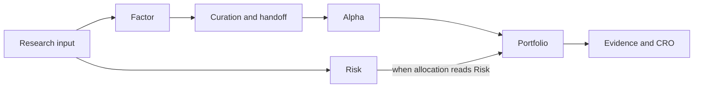

# Research dependencies and results
Date: 2026-10-08

State the question you want answered. A prepared workspace or installed strategy starts from its strategy controls; new Factor, Alpha, Risk or Portfolio exploration follows the dependencies below. The [research-agent guide](../../AGENTS.md#choose-the-path-by-intent) owns the steps your agent takes from `workspace show` and each answer's offered requests.

## Choose the research question

Preparation and updates can publish immutable inputs. Each study retains its input, evaluated sessions, decision cutoff, method and execution bounds; newer data does not revise an earlier result. Controls show completed prerequisites, gaps and offered choices. An available study is not automatically the selected one.

| Question | Required evidence and expected answer |
| --- | --- |
| Does this Factor warrant further study? | Research input; coverage, screening and factor evidence |
| Does its Alpha candidate predict? | Curated Factor evidence and its handoff; scores, folds, support, comparisons and limits |
| What Risk does the input support? | The same research input, alongside Factor and Alpha; diagnostics and support |
| What book does this candidate produce? | Completed Factor-handoff Alpha and an explicit candidate; compatible Risk when the allocation rule reads it |
| What challenges that book? | Completed book; cited Evidence findings followed by a CRO assessment |
| Does a formula change the research result? | Compatible completed Factor-handoff Alpha, or a Portfolio built on it; a [formula trial](formula-factors.md#trial-and-review) |

Read Factor coverage before curation and Alpha's support before drafting a book. The curation receipt and exact Factor Task remain in the handoff lineage; this research does not activate the daily factor catalog. Family qualification covers the declared development family and nominated candidates, preserving other attempts. A favorable study alone does not qualify an installed strategy.

An activated agent model can be qualified with its declared family. Its current refit binds the state projected by its adapter and its numerical binding. For kinds other than `LINEAR` and `TREE`, stability compares training error and the current scores' mean, spread and coverage with the development folds. An agent-projected tree is refused as `ALPHA_CURRENT_REFIT_AGENT_TREE_UNSUPPORTED` because tree diagnostics read the installed family. The [model extension path](extending.md#alpha-model-extension) describes its contract, sandbox and activation requirements.

Risk can run in parallel on the same input. An allocation that reads Risk requires a compatible completed study in `portfolio.risk_task_id`; the equal-weight tranche rule refuses that field. A report-only Risk link can describe an equal-weight book without recalculating its weights or claiming covariance-based sizing. Compare books on compatible support and read metric units with values.

## Read an installed strategy's book and positions

A date's positions are reviewed on their own publication: the [guide's review path](../../AGENTS.md#review-the-dates-positions) uses `strategy-book review --update` and `review continue` to carry them through Analysts and the CRO. Ask for the whole-support book's review when you want the installed strategy's historical evidence; it replays the complete supported interval.

An open first-use goal delegates activation within 24 hours of opening, and activation admits the first update for the first use's date in the same act; the [guide](../../AGENTS.md#run-the-first-use-from-the-persons-sentence) explains the delegation and the person's decisions. The person stops it by telling their agent, or on **Portfolio**. Activation binds the component models, required calibration and sealed last book state; it performs no fit and publishes no future result. A changed package needs a new whole book and activation.

Before activation, inspect `strategy_dates.information_cutoff` and the conditional `first_actionable_session`. The cutoff combines required component information; an unknown cutoff stays `null`, with sources, detail and a known lower bound. The first forward decision can precede actionability. The first actionable session is the planned entry strictly after activation, or after the current clock in a conditional offer. Earlier forward sessions through the cutoff are causal replay inside the research window, never out-of-sample evidence.

The activation offer's `review_holdings` are the reviewed book's last sealed holdings with their decision and entry sessions. The first forward update publishes the next positions. Hold positions only from the first actionable session; read each publication's basis, dates and `claim`, with its Risk and CRO status. These are research positions, never orders or advice. Read the [guide's forward path](../../AGENTS.md#run-an-installed-strategy-forward) for updates and the returned horizon, about eleven months after the latest completed session at activation. A newer book is needed beyond it. Only a person enables daily research automation for named packages in **Settings**. The automation runs while Local Web serves the workspace.

## Read review standing and claim limits

Evidence preparation reports admitted source scope and gaps. Analysts provide cited issuer findings; the CRO separately challenges the exact book against them. Both give judgment without computing weights. Approved bundles preserve source restrictions. Read review standing, contrary evidence, citations and coverage together: a published review may be incomplete.

Result standing separates comparison, execution, contract, evidence and activation. A completed study is not activation. Its [temporal statement](temporal-statements.md) distinguishes evaluation, earlier input history, membership backfill, survivorship, Sector treatment and price basis. Pre-T0 history is not complete point-in-time membership or Sector history; fixed costs are not a capacity model. Development comparisons, qualification and publication establish no future returns or trading service.
